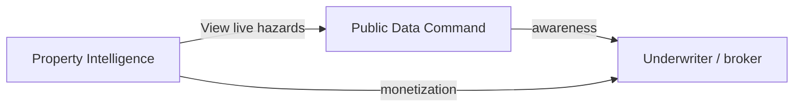

# Product Vision and Objectives

## What is AXIOM?

AXIOM is a **property & casualty insurance technology** company. This repository is the public marketing website plus two interactive products that demonstrate AXIOM's data and underwriting intelligence capabilities.

---

## Products in this repo

| Product | Route | Objective |
|---------|-------|-----------|
| **Home** | `/` | Marketing landing page; modals for COI Tracker and Insurance Manager (separate products, not routed here) |
| **Public Data Command** | `/public-data-command` | Live government hazard feeds on a dark command-center map — **no portfolios, no SOV uploads**, public data only |
| **Property Intelligence** | `/property-intelligence` | À la carte **COPE underwriting dossiers** for a single address — free OSINT and government data first, escalate to paid vendor APIs |

### Public Data Command

**Purpose:** Awareness and operational hazard context. Users see live earthquakes, weather alerts, wildfires, and flood zones scoped by global / national / local view.

**Audience:** Risk managers, underwriters, brokers who need real-time situational awareness without uploading client data.

**Data:** USGS, NWS, NASA FIRMS/EONET, FEMA NFHL, EPA AirNow (optional). All free public APIs.

### Property Intelligence

**Purpose:** Monetizable address-level underwriting intelligence. Users enter a US address, select data sources (or a preset package), see a live price quote, and generate a COPE report.

**Audience:** Insurance underwriters, MGAs, brokers preparing property submissions.

**COPE** = Construction, Occupancy, Protection, Exposure — the four pillars of commercial property underwriting.

**Data tiers:**

| Tier | Examples | Cost |
|------|----------|------|
| Free / OSINT | Census geocode, FEMA, USGS, NWS, OSM, hydrant/fire GIS, Crawl4AI | $0 API |
| Standard paid | RentCast, Regrid, Melissa | Per-call vendor fees |
| Insurance-grade | ATTOM (CoreLogic optional later), First Street | Higher vendor fees |
| Intelligence services | COPE mapper, conflict resolution, PDF dossier, OpenAI web research | Service fees |

---

## Business model (Property Intelligence)

- **Prepaid credits** via Stripe Checkout — no user login required.
- Anonymous wallet keyed by `anon_id` (stored in browser localStorage).
- Pricing formula: `(API cost + service cost) × 2.5` from `services/property-api/registry/sources.json`.
- Minimum charge: $0.99 when any API cost applies.
- Credit packs: $5/55, $25/300, $100/1300 credits (~10 credits per $1 of report price).
- Billing is **optional for local demos** — without `STRIPE_SECRET_KEY`, enrichment uses dry-run receipts.

---

## Strategic positioning

- **Public Data Command** = top-of-funnel awareness; shows AXIOM's live data capabilities.
- **Property Intelligence** = core product; generates revenue via à la carte source selection.
- **Cross-link:** After PI enrichment, "View live hazards at this location" deep-links to PDC with `?lat=&lng=&scope=local`.

---

## Presets (Property Intelligence)

| Preset ID | Label | Best for |
|-----------|-------|----------|
| `publicly_available` | Publicly available | Free OSINT + government hazards + COPE mapper |
| `cope_insurance` | COPE — insurance grade | ATTOM + protection GIS + PDF dossier; optional web search add-on |
| `property_basics` | Property basics | RentCast + FEMA + USGS |
| `vendor_comparison` | Vendor comparison | RentCast + Melissa + ATTOM side-by-side with conflict resolution |

**Vendor comparison** is the recommended preset for testing multi-source COPE completeness with configured API keys.

---

## Out of scope for this repo

| Item | Location | Notes |
|------|----------|-------|
| **Insurance Manager** | `InsuranceManager/` | Separate product; marketing deliverable kit only (deck/screenshots). Not routed in the website. |
| **COI Tracker** | Home modal only | Placeholder modal on marketing page |
| **CoreLogic / Cotality** | Backend adapters exist | Not yet selectable in catalog; ATTOM is the primary insurance-grade vendor |

---

## Production launch state

| Product | Production status |
|---------|-------------------|
| Home | Live on Vercel |
| Public Data Command | Live on Vercel |
| Property Intelligence | **Coming Soon** by default — requires `VITE_PROPERTY_INTELLIGENCE_ENABLED=true` |

See [07-environment-and-deployment.md](./07-environment-and-deployment.md) for launch checklist.

---

## See also

- [08-current-state-and-roadmap.md](./08-current-state-and-roadmap.md) — what's in flight now
- [../PROPERTY-INTELLIGENCE.md](../PROPERTY-INTELLIGENCE.md) — PI demo checklist and presets
- [../PUBLIC-DATA-COMMAND-ARCHITECTURE.md](../PUBLIC-DATA-COMMAND-ARCHITECTURE.md) — PDC technical details
