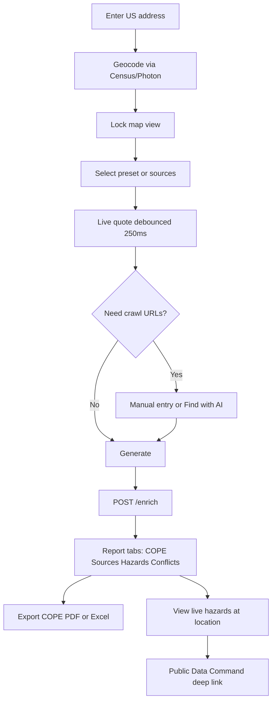
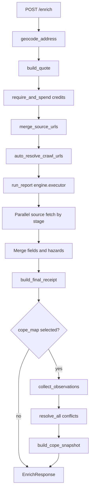
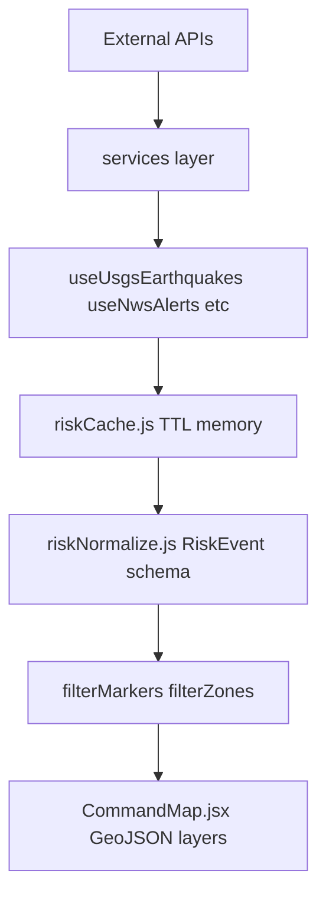
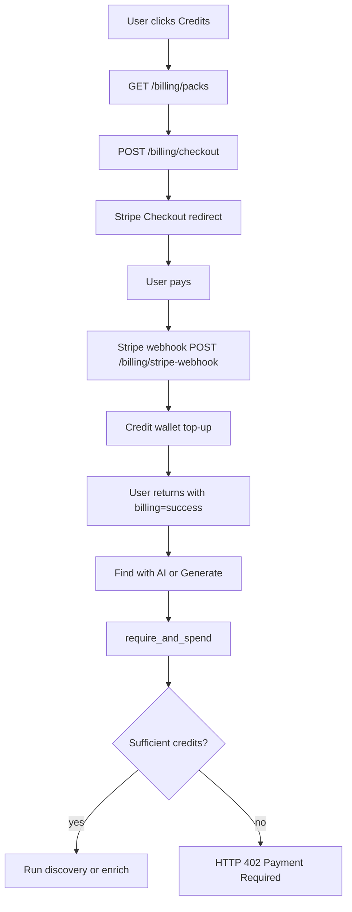
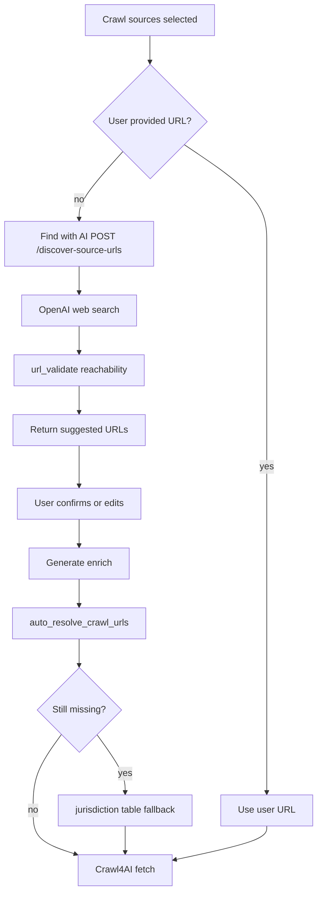
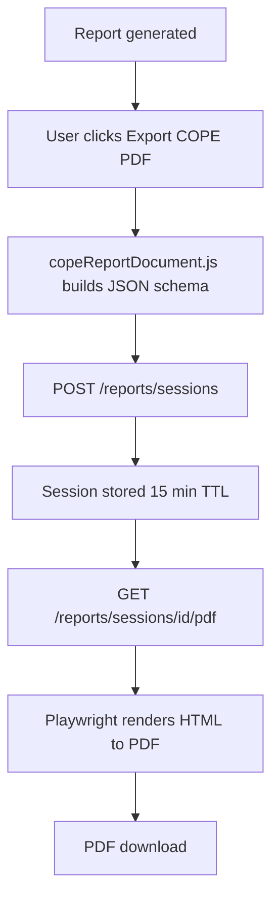

# Data Flows

End-to-end pipelines with diagrams. Use these to trace behavior before changing code.

---

## 1. Property Intelligence user flow



**Key files:**
- Frontend: `PropertyIntelligenceView.jsx`, `usePropertyReport.js`, `propertyApi.js`
- Backend: `main.py` `POST /enrich`

---

## 2. Enrich API pipeline (backend)



**Execution stages:** Sources whose `depends_on` are satisfied run in parallel within each stage. Example: `attom_hazard` waits for `attom_property`.

**Post-process stubs:** `cope_map`, `pdf_dossier`, `llm_extract` return synthetic success; real COPE work happens in step N above.

**Key files:** `main.py`, `engine/executor.py`, `merger/trust.py`, `merger/cope.py`

---

## 3. Public Data Command feed pipeline



**Feed sources:**

| Service | Hook | Refresh |
|---------|------|---------|
| USGS FDSNWS | `useUsgsEarthquakes` | 5 min |
| NWS api.weather.gov | `useNwsAlerts` | 3 min |
| NASA FIRMS/EONET | `useNasaFirms` | 15 min |
| FEMA NFHL | `useFemaNfhl` | 24 h |

**Dev proxy:** Vite proxies `/api/nws`, `/api/fema`, `/api/firms` to external APIs (see [07-environment-and-deployment.md](./07-environment-and-deployment.md)).

**Key files:** `src/data/commandMapData.js`, `src/services/*.js`, `src/hooks/use*.js`, `CommandMap.jsx`

---

## 4. Billing flow



**When billing disabled:** `STRIPE_SECRET_KEY` unset → dry-run receipts, no charges, Credits wallet hidden in UI.

**Credit conversion:** ~10 credits per $1 of estimated report price (`billing/credits.py`).

**Key files:** `billing/gate.py`, `billing/stripe_service.py`, `CreditsWallet.jsx`

---

## 5. Source URL discovery



**Two discovery paths:**
1. **Explicit:** User clicks "Find with AI" before generate → `POST /discover-source-urls` (may charge credits)
2. **Automatic:** During enrich → `auto_resolve_crawl_urls()` fills gaps

**Distinct from web property research:** URL discovery finds assessor/permit portal pages for Crawl4AI. Web property research enriches COPE fields directly via OpenAI.

**Key files:** `source_discovery/discover.py`, `resolve.py`, `jurisdiction.py`, `MapSourceDiscoveryHud.jsx`

---

## 6. COPE PDF export



**Excel export:** Entirely client-side via `copeReportExcel.js` + exceljs — no server dependency.

**Key files:** `copeReportDocument.js`, `report_pdf.py`, `report_html.py`

---

## 7. Earthquake report PDF (Public Data Command)

Separate from COPE PDF:

```mermaid
flowchart TD
    A[User selects earthquakes] --> B[EarthquakeReportBuilderModal]
    B --> C[reportApi.js createSession]
    C --> D[POST /reports/sessions]
    D --> E[/reports/print/sessionId Playwright]
    E --> F[PDF download]
```

Uses same report session infrastructure as COPE PDF but different document schema.

---

## See also

- [03-frontend-architecture.md](./03-frontend-architecture.md) — frontend entry points
- [04-backend-architecture.md](./04-backend-architecture.md) — backend entry points
- [../PUBLIC-DATA-COMMAND-ARCHITECTURE.md](../PUBLIC-DATA-COMMAND-ARCHITECTURE.md) — RiskEvent schema
