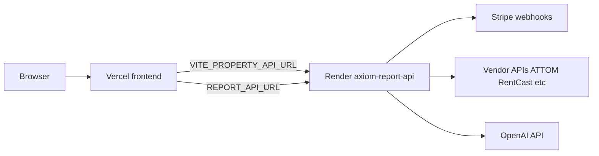

# Environment and Deployment

Local development setup, environment variables, and production deployment.

---

## Local development

### Recommended: both frontend and API

```powershell
cd c:\Users\Orcc_\OneDrive\Desktop\AXIOM\website
npm install
npm run dev:all
```

| Service | URL | Notes |
|---------|-----|-------|
| Vite frontend | http://127.0.0.1:5173 | Proxies `/api/*` to backend and external feeds |
| Property API | http://127.0.0.1:8000 | FastAPI with hot reload |

### Frontend only (Public Data Command)

```powershell
npm run dev
```

Works for `/public-data-command` — feeds use Vite dev proxies. Property Intelligence will show "API offline".

### Property API only

```powershell
npm run property-api:dev
```

### First-time Property API setup

```powershell
cd services/property-api
python -m venv .venv
.\.venv\Scripts\Activate.ps1
pip install -r requirements.txt
crawl4ai-setup
python -m playwright install chromium   # For PDF export
```

### Restart helper (Windows)

```powershell
npm run dev:restart   # Kills Python processes, restarts dev:all
```

### Validate keys

```powershell
npm run check:property-keys
```

Or click **Vendor keys** in the Property Intelligence header.

---

## Environment files

The property API loads **both**:
- `.env.local` (repo root)
- `services/property-api/.env`

Copy from `.env.example` and `services/property-api/.env.example` if present.

**Never commit `.env`, `.env.local`, or API keys.**

---

## Environment variables

### Property API (backend)

| Variable | Required | Purpose |
|----------|----------|---------|
| `RENTCAST_API_KEY` | For RentCast source | Property data vendor |
| `ATTOM_API_KEY` | For ATTOM sources | Insurance-grade property + hazard |
| `MELISSA_LICENSE_KEY` | For Melissa source | Property data vendor |
| `REGRID_API_KEY` | For Regrid source | Parcel boundaries |
| `FIRSTSTREET_API_KEY` | For First Street | Climate risk |
| `OPENAI_API_KEY` | For AI features | URL discovery, web research, conflict resolve |
| `STRIPE_SECRET_KEY` | For billing | Enables credit packs; omit for dry-run demos |
| `STRIPE_WEBHOOK_SECRET` | For billing webhooks | From Stripe CLI or Dashboard |
| `FRONTEND_URL` | Production | CORS + Checkout redirect (e.g. `https://www.axiompropertycasualty.com`) |
| `DATABASE_URL` | Production billing | Postgres; omit for local SQLite fallback |

### Careers application (Vercel serverless)

Served at `/api/careers/organize` and `/api/careers/apply`. Local dev uses the Vite careers plugin (`scripts/vite-careers-api.js`).

Applications are saved to storage and reviewed at `/careers/admin` (no email required).

| Variable | Required | Purpose |
|----------|----------|---------|
| `CAREERS_ADMIN_TOKEN` | For admin console | Bearer secret for `/careers/admin` and admin API |
| `CAREERS_DATABASE_URL` | Production | Vercel Postgres / Neon connection string |
| `RESEND_API_KEY` | Optional (unused) | Legacy email delivery; not required for apply |
| `CAREERS_TO_EMAIL` | Optional (unused) | Legacy internal notification recipient |
| `CAREERS_FROM_EMAIL` | Optional (unused) | Legacy verified sender for Resend |
| `CAREERS_SITE_URL` | Optional | Logo + footer links in email templates if re-enabled |
| `CAREERS_REPLY_EMAIL` | Optional (unused) | Legacy reply-to on applicant confirmation |
| `NVIDIA_API_KEY` | For free AI organize | `nvapi-` key from [build.nvidia.com](https://build.nvidia.com) — preferred provider |
| `CAREERS_LLM_BASE_URL` | Optional | Default `https://integrate.api.nvidia.com/v1` |
| `CAREERS_LLM_MODEL` | Optional | Default `nvidia/nemotron-mini-4b-instruct` (fast) |
| `OPENAI_API_KEY` | Fallback | Used when `NVIDIA_API_KEY` is unset |
| `OPENAI_CAREERS_MODEL` | Optional | OpenAI fallback model; default `gpt-4o-mini` |

**Local dev without Postgres:** submissions are stored under `.careers-data/` when `NODE_ENV=development` (Vite sets this). Set `CAREERS_ADMIN_TOKEN` in `.env.local`, restart dev, submit at `/careers`, review at `/careers/admin`.

### Frontend (Vite)

| Variable | When | Purpose |
|----------|------|---------|
| `VITE_PROPERTY_INTELLIGENCE_ENABLED` | Production launch | `true` to enable PI (default: Coming Soon) |
| `VITE_PROPERTY_API_URL` | Production launch | Backend URL (e.g. `https://axiom-report-api.onrender.com`) |
| `VITE_GOOGLE_MAPS_API_KEY` | Street View | Google Maps Embed + Metadata API |
| `VITE_NASA_FIRMS_MAP_KEY` | Optional PDC | NASA FIRMS VIIRS hotspots (fallback: EONET) |
| `VITE_AIRNOW_API_KEY` | Optional PDC | EPA AirNow (fallback: Open-Meteo AQI) |
| `VITE_REPORT_API_URL` | Production | Report/PDF API base URL |
| `VITE_PLAUSIBLE_DOMAIN` | Analytics (optional) | Site domain registered in Plausible; omit to disable analytics |
| `VITE_PLAUSIBLE_SCRIPT_URL` | Analytics (optional) | Plausible script URL; defaults to `https://plausible.io/js/script.js`. For self-hosted CE, use your instance URL (e.g. `https://plausible.yourdomain.com/js/script.js`) |

### Local demo (Path A — no Stripe)

Run `npm run dev:all` without `STRIPE_SECRET_KEY`:
- Enrichment uses dry-run receipts (no credit charges)
- Credits wallet hidden in UI
- All vendor sources work if keys are set

---

## Feature gates

| Environment | Property Intelligence |
|-------------|----------------------|
| `npm run dev` | Always enabled |
| Vercel production | Coming Soon unless `VITE_PROPERTY_INTELLIGENCE_ENABLED=true` |
| Vercel preview | Set `VITE_PROPERTY_INTELLIGENCE_ENABLED=true` to test |

Simulate production locally:

```powershell
# Add to .env.local:
# VITE_PROPERTY_INTELLIGENCE_ENABLED=false
npm run build && npm run preview
```

Logic: `src/config/features.js`

---

## Vite dev proxies

From `vite.config.js`:

| Frontend path | Target | Purpose |
|---------------|--------|---------|
| `/api/nws` | `api.weather.gov` | NWS weather alerts |
| `/api/fema` | `hazards.fema.gov` | FEMA NFHL flood zones |
| `/api/firms` | `firms.modaps.eosdis.nasa.gov` | NASA FIRMS wildfire |
| `/api/property` | `127.0.0.1:8000` | Property Intelligence API |
| `/api/reports` | `127.0.0.1:8000/reports` | PDF report sessions |
| `/api/census` | `geocoding.geo.census.gov` | US address geocoding |
| `/api/photon` | `photon.komoot.io` | Address autocomplete |

**Production note:** Public Data Command requires an equivalent reverse proxy with NWS `User-Agent` header on Vercel or CDN.

---

## Deployment architecture



| Component | Host | Config |
|-----------|------|--------|
| Frontend | Vercel | Auto-deploy from git |
| Property API | Render | `render.yaml` → Docker `services/property-api/Dockerfile` |
| Billing DB | Render Postgres | `DATABASE_URL` env var |

### Render env vars (`render.yaml`)

| Key | Notes |
|-----|-------|
| `FRONTEND_URL` | `https://www.axiompropertycasualty.com` |
| `REPORT_SESSION_TTL_SECONDS` | `900` |
| `STRIPE_SECRET_KEY` | sync: false (set in dashboard) |
| `STRIPE_WEBHOOK_SECRET` | sync: false |
| `OPENAI_API_KEY` | sync: false |
| `DATABASE_URL` | sync: false |

### Vercel env vars (launch checklist)

| Variable | When to set |
|----------|-------------|
| `NVIDIA_API_KEY` | Careers form — free "Organize thoughts" via Nemotron Mini on NVIDIA NIM |
| `REPORT_API_URL` | Always (PDC PDF proxy) |
| `VITE_PROPERTY_INTELLIGENCE_ENABLED` | When launching PI → `true` |
| `VITE_PROPERTY_API_URL` | When launching PI |
| `VITE_GOOGLE_MAPS_API_KEY` | When Street View needed |

While PI is gated, omit `VITE_PROPERTY_INTELLIGENCE_ENABLED`, `VITE_PROPERTY_API_URL`, and `VITE_GOOGLE_MAPS_API_KEY`.

---

## Launch checklist

1. Set `VITE_PROPERTY_INTELLIGENCE_ENABLED=true` on Vercel → redeploy
2. Set `VITE_PROPERTY_API_URL=https://axiom-report-api.onrender.com` on Vercel
3. Set `VITE_GOOGLE_MAPS_API_KEY` if Street View needed
4. Configure Stripe on Render per [../BILLING-SETUP.md](../BILLING-SETUP.md)
5. Verify: `npm run smoke:billing` (local) and mobile Checkout checklist in BILLING-SETUP

---

## Billing local setup

See [../BILLING-SETUP.md](../BILLING-SETUP.md) for full Stripe CLI webhook forwarding.

Quick version:

```powershell
winget install Stripe.StripeCli
stripe login
stripe listen --forward-to http://127.0.0.1:8000/billing/stripe-webhook
# Copy whsec_... to STRIPE_WEBHOOK_SECRET, restart dev:all
```

---

## See also

- [../PROPERTY-INTELLIGENCE.md](../PROPERTY-INTELLIGENCE.md) — PI demo checklist
- [../BILLING-SETUP.md](../BILLING-SETUP.md) — Stripe webhook details
- [../GOOGLE-MAPS-SETUP.md](../GOOGLE-MAPS-SETUP.md) — Street View setup
- [render.yaml](../../render.yaml) — Render deploy config
